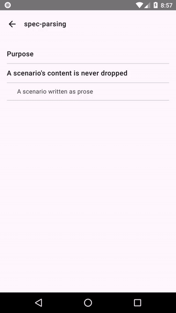
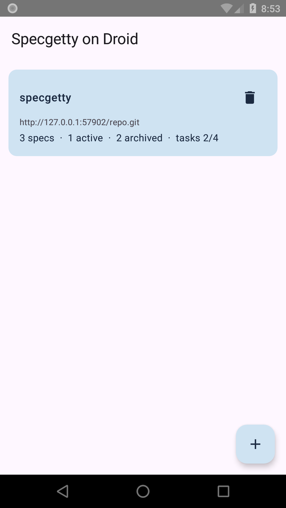
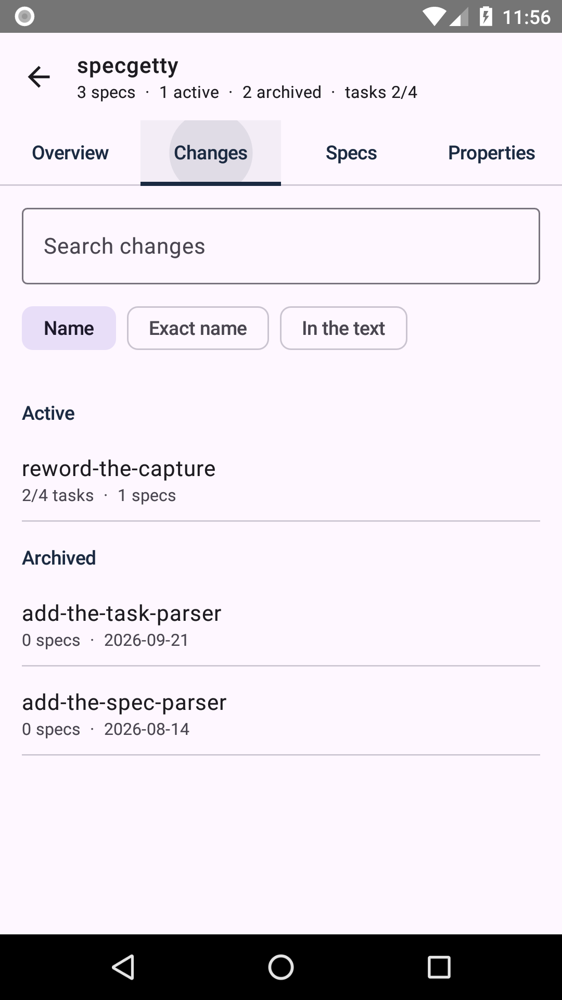
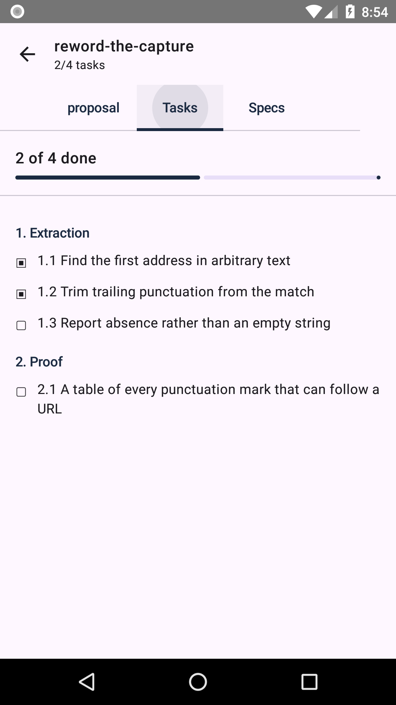
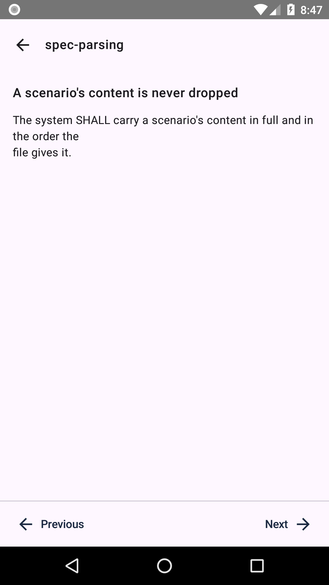
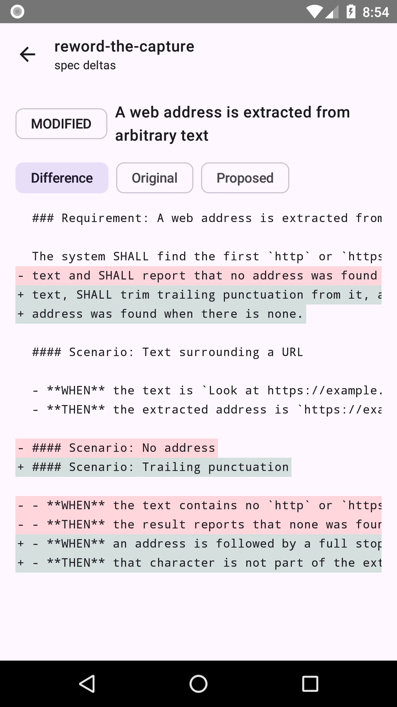
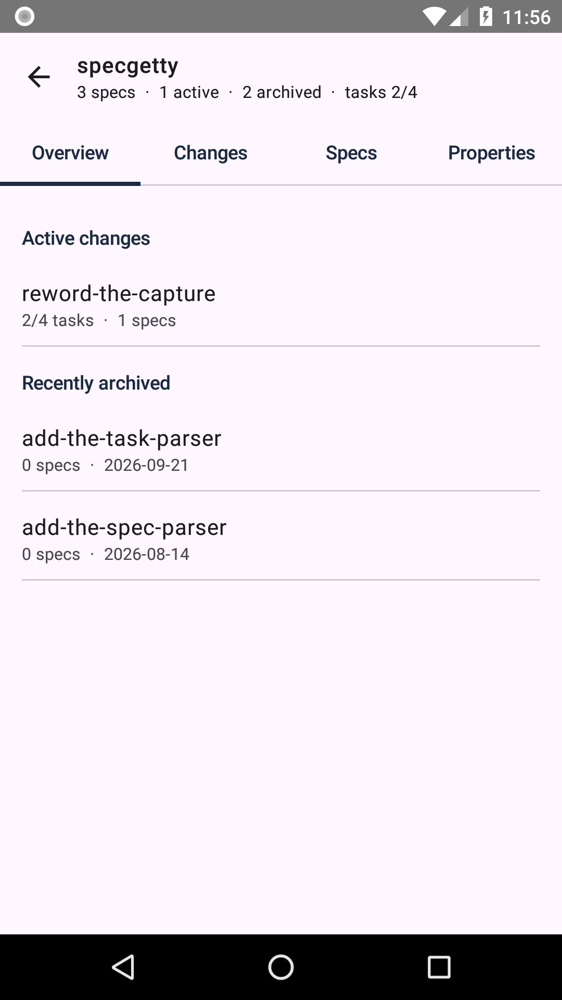
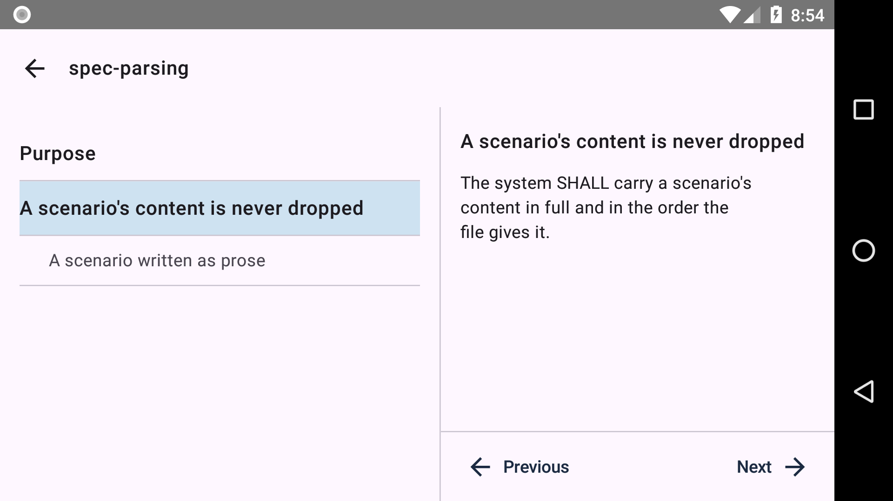

# Specgetty on Droid

[](https://github.com/speclib/specgetty-mobile/actions/workflows/check.yml)
[](https://github.com/speclib/specgetty-mobile/actions/workflows/check.yml)


[](BRIEFING.md)
[](LICENSE)

An Android app for reading [OpenSpec](https://github.com/Fission-AI/OpenSpec)
projects that live in git repositories. It is the mobile counterpart of
[specgetty](https://github.com/speclib/specgetty), the OpenSpec terminal
browser, and borrows its git layer from
[beans-on-droid](https://github.com/mipmip/beans-on-droid).

This app is not affiliated with the OpenSpec project.



## Why

Writing software has moved from typing code to reviewing what a machine
proposes, and the bottleneck moved with it. There are more specifications and
more proposed changes to read than there used to be, and they are read in
editors built for writing code rather than for reading a behaviour contract.

A phone is where the rest of that reading happens. This app is for the review
you do away from the desk: on the sofa, on a train, in the ten minutes before a
meeting where you are expected to have an opinion about a change.

[OpenSpec](https://github.com/Fission-AI/OpenSpec) is the format it reads. A
project keeps its requirements under `openspec/specs/` and its proposed work
under `openspec/changes/`, as markdown, in the repository they belong to.

## What it does

Clones a repository over HTTPS and lets you read all of it on a phone.

- **Repositories.** Add one by its HTTPS clone URL, by scanning a QR code, or by
  sharing a link into the app. Each row shows how many specs the project has,
  how many changes are active and archived, and how far the open tasks have got.
- **Project.** Four tabs: an overview, the changes, the specs, and the project's
  own configuration with the workflow schemas its changes use.
- **Changes.** One list, active and archived, searchable. Typing matches change
  names loosely; a leading `:` searches the text inside each change and says
  which files matched.
- **A change.** A tab per artifact file it actually has, rendered as Markdown,
  plus its task list with a box per task beside the progress.
- **Spec deltas.** Every requirement a change adds, modifies, removes or
  renames. For a change not yet archived, a modified requirement can be compared
  with the one it modifies: the difference, the original and the proposed.
- **A spec.** Its purpose, its requirements and their scenarios, each with a
  card, steppable one to the next. A file that does not fit the OpenSpec grammar
  still opens, lists every reason why with its line, and stays readable.

Phase 1 reads. It does not edit, tick tasks, archive, discard, export, commit or
push. See the roadmap.

## Install

A signed APK is published with each release. It installs on any phone running
Android 8.0 (API 26) or newer.

```bash
gh release download --repo speclib/specgetty-mobile --pattern '*.apk'
adb install -r specgetty-on-droid-*.apk
```

Without `adb`, download the APK from the
[latest release](https://github.com/speclib/specgetty-mobile/releases/latest)
onto the phone and open it; Android will ask you to allow installing from that
source.

To check what you downloaded is what this project signed:

```bash
apksigner verify --print-certs specgetty-on-droid-*.apk
```

It carries `CN=Specgetty on Droid, O=speclib, C=NL`. The full fingerprint is in
[docs/fdroid.md](docs/fdroid.md).

Or build it yourself:

```bash
nix develop --command ./gradlew assembleDebug
adb install -r app/build/outputs/apk/debug/app-debug.apk
```

The debug build is unminified and carries the debug signing key, so it is about
36 MB and cannot be updated by a release APK.

## Adding a repository and a token

A public repository needs only its HTTPS clone URL:

```
https://github.com/speclib/specgetty
```

You do not have to get it exactly right. A page URL copied from a browser is
turned into one that clones: the query string and the fragment are dropped, and
a path that continues into a view of the repository, such as `/issues/12` or
`/tree/main/src`, is truncated back to the repository itself. The result lands
in the form, editable, and nothing is cloned until you press **Add**.

Three ways in, all ending at the same form:

- **Type or paste** the URL.
- **Scan a QR code** with the camera. Camera access is asked for the first time
  you scan, and refusing it leaves everything else working.
- **Share a link** into the app from a browser or a forge app.

SSH URLs are refused with a message saying so. Phase 1 speaks HTTPS only.

## A private repository

Two ways, and the form offers both.

**Authorize with GitHub**, for a repository on github.com. Tap **Or authorize
with GitHub instead**. The app shows a short code, you open github.com in a
browser, type the code, and approve. GitHub then asks which repositories the app
may see; approving without choosing any leaves it able to read nothing, so
choose the one you are adding. The app reads the answer back and tells you what
it was granted, rather than reporting success and failing at the clone. A
repository owned by an organization needs the app installed there too, which an
owner may have to approve. The credential expires after about eight hours, renews
itself before the next read, and is read-only.

**Type an access token**, for any host, github.com included. Create a personal
access token with read access and type it into the form. Type it yourself: it is
never taken from a scanned code or a shared link, because a token on a
photographable surface is a token you have given away.

Either way, the credential is encrypted with a key held in the Android Keystore,
kept apart from the list of repositories, and deleted with the repository.
Nothing is stored until you press **Add**.

## A repository holding several projects

One repository can hold more than one OpenSpec project, one per directory. The
app lists what it found and you choose which to add; each becomes its own row
with its own counts. A repository holding one project is added straight away.

Rows from one repository share one downloaded copy and one credential.
Refreshing fetches once and reloads all of them. Removing a row frees nothing
while another remains, and the confirmation says which of the two is about to
happen.

A project is found where an `openspec/` directory holds `config.yaml`,
`config.yml` or `project.md`. Which projects a repository holds is settled when
you add it; one added to the remote later appears by adding the repository
again.

## A repository that points at a store

A repository whose `openspec/config.yaml` reads `store: <id>` and keeps no specs
of its own names content kept elsewhere, resolved through a registry of local
paths on the machine that wrote it. A phone has neither, so the app cannot
follow it. It says so, naming the id and the file that declared it, rather than
claiming there is no project. Add the repository that holds the content instead.

## Screenshots

| | | |
|---|---|---|
|  |  |  |
| The repository list | The change list | A change's tasks |
|  |  |  |
| A requirement as a card | What a change would change | The project overview |

On a tablet, or a phone turned sideways, the outline and the card are shown
together:



## Building and the gate

```bash
nix develop --command ./gradlew assembleDebug   # build
scripts/gate.sh                                 # what decides a change may ship
```

The gate runs `nix flake check`, then a debug assemble, the unit tests, Android
lint and the coverage verification. Every push runs the same script, which is
what the badges above report. Without nix you need a JDK 17 and an Android SDK
with build tools 37.0.0 and platforms 26 and 37.

The instrumented tests need an emulator, so they are not in the gate. Run them
before a release, and regenerate the pictures when the app looks different:

```bash
nix develop .#emulator --command ./scripts/e2e.sh
nix develop .#emulator --command ./scripts/screenshots.sh
nix develop .#emulator --command ./scripts/recording.sh
```

The grammar is not invented here. specgetty's `openspec/specs/` defines it and
its fixtures pin it, each taken from a live spec rather than made up. Those
fixtures are copied into this project's tests, along with specgetty's whole
`openspec/` tree. Where this app and specgetty could be read as disagreeing,
specgetty decides.

## Roadmap

Phase 2 is editing: ticking a task writes `tasks.md` back and commits and pushes
it through JGit. `RepoStore` grows write, commit and push, and the task parser
grows a renderer that rebuilds the file as it is on disk, which is what
specgetty's `task-checkboxes` requires.

Not planned: SSH authentication, background sync, or scanning for projects
anywhere but an `openspec/` directory in a repository.

## Contributing

Issues and pull requests are welcome at
[github.com/speclib/specgetty-mobile](https://github.com/speclib/specgetty-mobile/issues).
Every push runs the same gate a change ships through, so a pull request reports
its own verdict.

This app is itself written with OpenSpec: its behaviour lives in
`openspec/specs/`, and a change starts as a proposal under `openspec/changes/`.
The badges above count them. `BRIEFING.md` is the source of truth for what Phase
1 is.

## Related

- [OpenSpec](https://github.com/Fission-AI/OpenSpec), the format this app reads
- [specgetty](https://github.com/speclib/specgetty), the same specs in a terminal
- [openspec.nvim](https://github.com/speclib/openspec.nvim), the same specs in neovim
- [awesome-openspec](https://github.com/speclib/awesome-openspec), what else
  exists around the format
- [beans-on-droid](https://github.com/mipmip/beans-on-droid), where the git layer
  came from

## Licence

Apache License 2.0. See [LICENSE](LICENSE).
